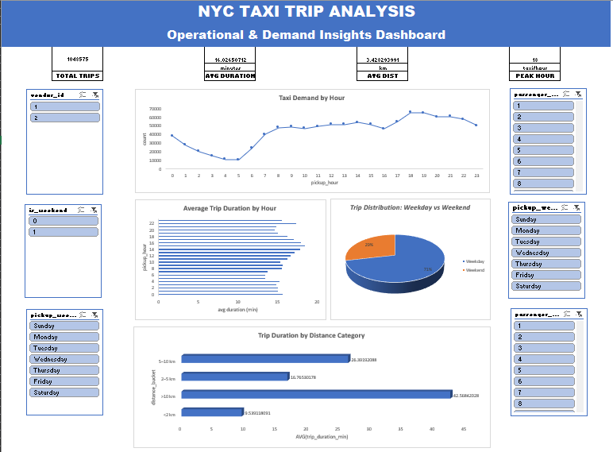

# 🚕 NYC Taxi Trip Duration Analysis

## 📌 Project Overview

This project presents a **production-level data analysis** of New York City taxi trip data, focusing on travel demand patterns, temporal trends, and trip distance behavior. The goal is to simulate a real-world analytics workflow combining **data cleaning**, **SQL analysis**, and an **interactive Excel dashboard** for business-friendly insights.

The project is designed to be **portfolio-ready** and **interview-ready** for data analyst roles.

---

## 📎 Dataset Attribution

This project uses the **NYC Taxi Trip Duration** dataset made publicly available by **Yasser H.** on Kaggle.

* **Source:** Kaggle
* **Dataset:** NYC Taxi Trip Duration
* **Author:** Yasser H.
* **URL:** [https://www.kaggle.com/datasets/yasserh/nyc-taxi-trip-duration](https://www.kaggle.com/datasets/yasserh/nyc-taxi-trip-duration)

The dataset is used strictly for **educational and analytical purposes**.

---

## 📂 Project Structure

```
nyc-taxi-trip-analysis/
├── data/
│   ├── raw/
│   │   └── NYC.csv
│   └── cleaned/
│       └── nyc_taxi_cleaned.csv
│
├── excel_dashboard/
│   └── NYC_Taxi_Trips_Analysis_Dashboard.xlsx
│
├── assets/
│   ├── charts/
│   │   ├── taxi_demand_by_hour.png
│   │   ├── trips_by_hour_bar.png
│   │   ├── trip_distance_bucket_bar.png
│   │   └── weekend_vs_weekday_pie.png
│   │
│   └── dashboard/
│       └── nyc_taxi_dashboard_overview.png
│
├── sql/
│   └── interview_questions.sql
│
├── report/
│   └── NYC_Taxi_Trips_Analysis_Report.pdf
│
└── README.md
```

---

## 📊 Dashboard Preview



---

## 🔍 Key Analysis Insights

* Taxi demand peaks during **evening commute hours (17:00–19:00)**
* **Weekday trips dominate**, indicating commuter-driven usage
* Majority of trips are **short-distance (< 2 km)**
* Late-night and early-morning hours show significantly lower demand
* Zero-duration trips were identified and removed as data anomalies

---

## 📈 Visualizations Included

All charts are exported from Excel and stored in `assets/charts/`:

* Taxi Demand by Hour
* Trips by Hour (Bar Chart)
* Trip Distance Distribution (Bucketed)
* Weekend vs Weekday Trips (Pie Chart)

---

## 🧠 Skills Demonstrated

* Data Cleaning & Feature Engineering (Pandas)
* Exploratory Data Analysis (EDA)
* Business KPI Definition
* Excel Dashboarding (Pivot Tables, Slicers, Charts)
* Interview-Grade SQL Querying
* Analytical Reporting (LaTeX)

---

## 📄 Report

A detailed analytical report written in **LaTeX** and compiled to PDF is available here:

```
report/NYC_Taxi_Trips_Analysis_Report.pdf
```

---

## 🚀 How to Use

1. Open the Excel dashboard:

```
excel_dashboard/NYC_Taxi_Trips_Analysis_Dashboard.xlsx
```

2. Use slicers to explore:

   * Pickup hour
   * Weekend vs weekday
   * Trip distance buckets
3. Review SQL queries for interview preparation

---

## 🧑‍💻 Author
**Sagnik Bhattacharya**